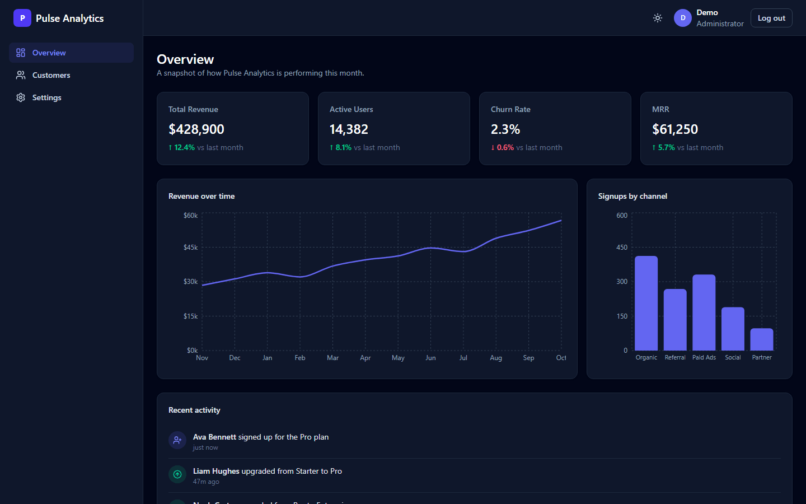
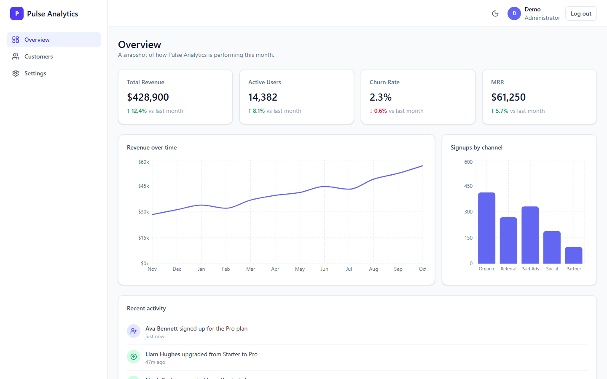
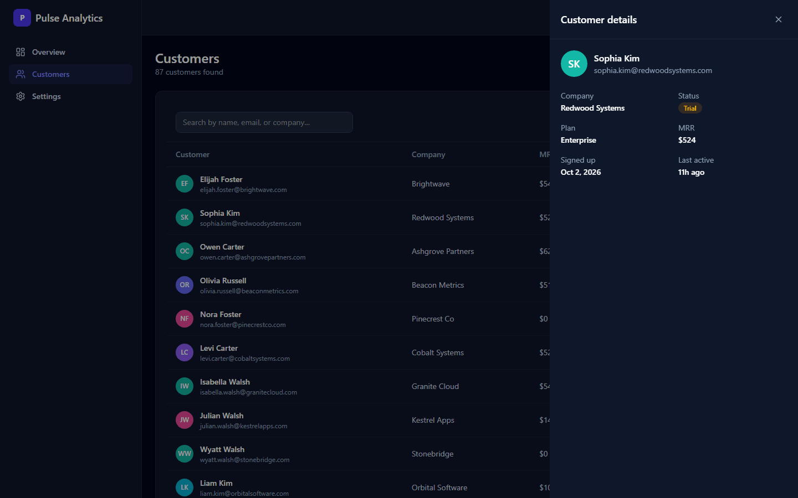
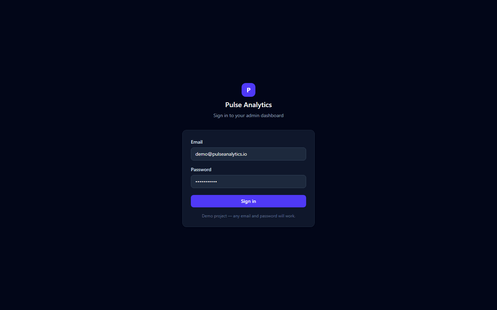
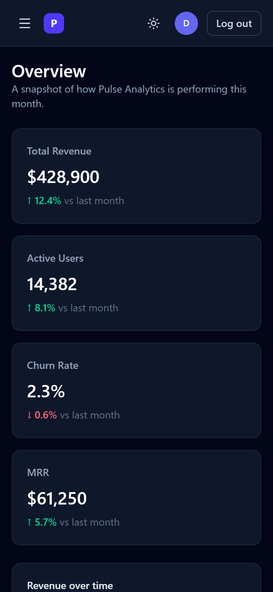

# Pulse Analytics — Admin Dashboard

A modern SaaS admin dashboard built with React 19, TypeScript, Tailwind CSS v4 and Recharts, with dark and light themes.

**[Live demo](https://pulse-analytics-touka.vercel.app)** · sign in with any email and password.



> **Concept project.** Pulse Analytics is a fictional SaaS product. This is a portfolio piece showcasing a modern admin dashboard UI — there is no real backend, no real users, and no real data. All numbers are generated mock data.

## Screenshots

| Overview (light) | Customers with detail drawer |
| --- | --- |
|  |  |

| Login | Mobile (375px) |
| --- | --- |
|  |  |

## Features

- **Fake authentication** — any email/password combination signs you in; session is kept in memory + `sessionStorage` so refreshing stays logged in.
- **Overview dashboard** — 4 KPI cards (revenue, active users, churn rate, MRR) with month-over-month change, a 12-month revenue line chart, a signups-by-channel bar chart, and a recent activity feed.
- **Customers directory** — searchable, sortable, filterable data table with pagination and a slide-in detail drawer for each customer.
- **Settings** — profile form with client-side validation (required fields, email format, character limits).
- **Dark / light mode** — toggle in the top bar, persisted to `localStorage`, respects system preference on first load.
- **Responsive layout** — sidebar collapses into a mobile drawer below the `lg` breakpoint.
- **Loading & empty states** — skeleton placeholders while mock data "loads," and empty states when filters return nothing.
- **Fake API layer** — every data-fetching function lives in `src/data/api.ts` and returns a `Promise` with an artificial network delay, so swapping in a real backend later is a drop-in replacement.

## Tech stack

| Layer | Choice |
| --- | --- |
| Framework | React 19 + TypeScript (strict mode, no `any`) |
| Build tool | Vite |
| Styling | Tailwind CSS v4 |
| Charts | Recharts |
| Routing | React Router v7 |
| Linting | oxlint |

## Project structure

```
src/
  components/
    layout/      # Sidebar, Topbar, AppLayout, ProtectedRoute
    overview/    # KpiCard, RevenueChart, SignupsChart, ActivityFeed
    customers/   # CustomerTable, CustomerDrawer
    settings/    # ProfileForm
    ui/          # Shared primitives: Card, Badge, Avatar, Skeleton, EmptyState, Pagination
  context/       # AuthContext, ThemeContext
  hooks/         # useAuth, useTheme, useAsyncData
  data/          # Mock datasets + fake async "API" layer (api.ts)
  lib/           # Formatting and delay helpers
  pages/         # LoginPage, OverviewPage, CustomersPage, SettingsPage
  types/         # Shared TypeScript interfaces
```

## Getting started

```bash
npm install
npm run dev
```

Open the printed local URL, enter any email and password on the login screen, and you're in.

Other scripts:

```bash
npm run build     # type-check + production build
npm run preview   # preview the production build locally
npm run lint       # oxlint
```

## Deploying to Vercel

The repo includes a `vercel.json` with an SPA rewrite rule so client-side routes resolve correctly. Push to a Git provider, import the repo in Vercel, and it will auto-detect the Vite build (`npm run build`, output directory `dist`) — no additional configuration needed.

## Swapping in a real backend

Every function in `src/data/api.ts` is an `async` function that returns mock data after a simulated delay. To connect a real backend, replace the bodies of those functions with real `fetch`/SDK calls that resolve to the same TypeScript types — no calling code needs to change.
